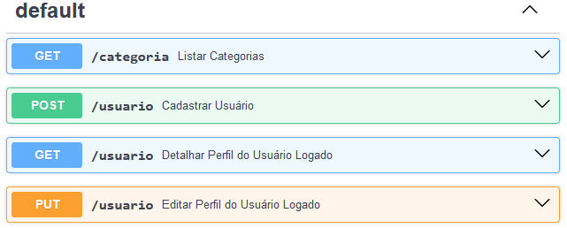

---
# Equipe - KDOlink
### Projeto PDV Cubos Academy - Sprint 1:

***O projeto é a criação de uma API para um PDV (Frente de Caixa). Este será o projeto piloto, ou seja, futuramente haverá novas funcionalidades.***

### 1.1 Schema

**IMPORTANTE:** Deverá ser criado no projeto o arquivo SQL que conterá os comandos de criação das tabelas, respeitando os nomes das tabelas e colunas, além de conter os comandos para a inserção das categorias que devem ser previamente cadastradas (estão citadas na 1ª Sprint no item Listar Categorias).

- Schema para criação do banco de dados pdv.
- Conectar o banco de dados "pdv" à API para persistir e manipular os dados de categorias, clientes, pedidos, produtos e usuários.
- Criar o banco de dados online.
- Qualquer valor monetário deverá ser representado em centavos, ex.: R$ 10,00 = 1000.
- Criar a tabela "usuarios".
- A tabela "usuarios" deverá conter os campos: id (auto incremento e chave primária, não permitindo alterações após criado), nome (limite de 100 caracteres), email (o email deverá ser único e ter limite de 100 caracteres) e senha(mínimo de 6 caracteres).
- Criar a tabela "categorias".
- A tabela "categorias" deverá conter os campos: id (auto incremento) e descricao (com limite de até 50 caracteres).
- Inserir categorias no banco de dados:

  ##### As categorias a seguir precisam ser previamente cadastradas para que sejam listadas no endpoint de listagem das categorias.
  - INSERT INTO categorias (descricao) VALUES:
    ('Informática'),
    ('Celulares'),
    ('Beleza e Perfumaria'),
    ('Mercado'),
    ('Livros e Papelaria'),
    ('Brinquedos'),
    ('Moda'),
    ('Bebê'),
    ('Games')

***Tecnologias:***
- **PostgreSQL**
- **ElephantSQL**
- **Beekeeper**

***1.2 Endpoints da 1ª sprint:***

**Importante 1:** Sempre que a validação de uma requisição falhar, responda com código de erro e mensagem adequada à situação.

**Importante 2:** Para endpoints de cadastro/atualização, os objetos de requisição devem conter as propriedades equivalentes às colunas das tabelas.

***Status Codes da API:***
```javascript
// 200 (OK) = requisição bem sucedida
// 201 (Created) = requisição bem sucedida e algo foi criado
// 204 (No Content) = requisição bem sucedida, sem conteúdo no corpo da resposta
// 400 (Bad Request) = o servidor não entendeu a requisição pois está com uma sintaxe/formato inválido
// 401 (Unauthorized) = o usuário não está autenticado (logado)
// 403 (Forbidden) = o usuário não tem permissão de acessar o recurso solicitado
// 404 (Not Found) = o servidor não pode encontrar o recurso solicitado
// 500 (Internal Server Error) = erro inesperado do servidor
```

***Tecnologias:***
- Node.js
  - ***Dependências:***
    - bcrypt
    - dotenv
    - express
    - handlebars
    - jsonwebtoken
    - knex
    - nodemailer
    - pg
    - joi
- VSCode
- Insomnia

***1.2.0 - Conexão com o banco:***
A conexão com o banco de dados deverá ser feita usando o Knex. Também serão usadas variáveis de ambiente para preservar a integridade das informações do banco.

***1.2.1 - Listar Categorias:***
**Endpoint:** GET /categoria

A rota GET /categorias deverá ser usada para listar todas as categorias cadastradas.

**Exemplo:**
***Status Codes:***
- 200(OK): Requisição bem sucedida
```javascript
// saída
{
    "id": 1,
    "descricao": "Informática"
}
{
    "id": 2,
    "descricao": "Celulares"
}...
```
*Considerações para listar categorias:*
- Sem parâmetros de rota ou de query.
- Não deverá possuir conteúdo no corpo (body) da requisição.

***1.2.2 - Cadastrar Usuário:***
**Endpoint:** POST /usuario

Esta será a rota usada para cadastrar novos usuários no sistema.

***Critérios de aceite:***
- Validar os campos obrigatórios: nome, email, senha.
- A senha deve ser criptografada utilizando algum algoritmo de criptografia confiável.
- O campo email no banco de dados deve ser único para cada registro, não permitindo dois usuários possuírem o mesmo email.

***Corpo da requisição:***
```javascript
// entrada
{
    "nome": "Nome do Usuário",
    "email": "usuario@email.com",
    "senha": "senha123"
}
```
***Status Codes:***
- 201(Created): Usuário cadastrado com sucesso.
- 400(Bad request): Erro de validação nos campos obrigatórios.
- 500(Internal server error): Erro interno do servidor.

*Considerações para cadastro de usuário:*
- Sem parâmetros de rota ou de query.
- O corpo (body) deverá conter o objeto que será persistido no banco.
- O nome deverá ser uma string. Também tratar a entrada, por exemplo, se o usuário digitar: JOaO silvA, salvar no banco de dados como Joao Silva.
- O email deverá ser uma string, conter um "@" e depois um ".".
- Adicionar validações para garantir que o campo senha atenda os requisitos mínimos (mínimo 6 caracteres).
- Verificar se o email já existe na base de dados de usuários.
- o email deverá ser salvo com todas as letras minúsculas no banco de dados.
- Criptografar a senha antes de persistir no banco de dados.
- Em caso de sucesso, não deverá retornar o objeto no corpo da requisição, apenas o status de confirmação.
- Validar campos obrigatórios.

***1.2.3 - Efetuar Login:***
**Endpoints:** POST /login

Esta rota permitirá ao usuário cadastrado realizar login no sistema.

***Critérios de aceite:***
- Validar se o email e a senha estão corretos para o usuário em questão.
- Gerar um token de autenticação para o usuário.

***Corpo da requisição:***
```javascript
// entrada
{
    "email":

 "usuario@email.com",
    "senha": "senha123"
}
```
***Status codes:***
- 200(OK): Login bem sucedido.
- 401(Unauthorized): Credenciais inválidas.
- 500(Internal server error): Erro interno do servidor.

*Considerações para efetuar login:*
- Sem parâmetros de rota ou de query.
- O corpo (body) deverá conter o objeto.
- Em caso de sucesso, deverá retornar o objeto com os dados do usuário.
- Verificar se o email está cadastrado e se a senha é compatível.
- Criar token de autenticação com o ID do usuário.
- Validar campos obrigatórios.

***Funcionalidades que só serão permitidas com o token.***

*Considerações para validação do token:*
- Validar se o token foi enviado no header da requisição (Bearer Token).
- Verificar se o token é válido.
- Consultar usuário no banco de dados pelo ID contido no token informado.

***2.1 Detalhar Perfil do Usuário Logado:***
**Endpoints:** GET /usuario

Esta rota permite que o usuário visualize os dados do próprio perfil de acordo com a validação do token.

```javascript
// saída
{
    "nome": "Nome do Usuário",
    "email": "usuario@email.com"
}
```

***Status codes:***
- 200(OK): Requisição bem sucedida.
- 401(Unauthorized): Token de autenticação ausente ou inválido.
- 500(Internal server error): Erro interno do servidor.

*Considerações de detalhar perfil:*
- Sem parâmetros de rota ou de query.
- Não deverá possuir conteúdo no corpo da requisição.
- Deverá retornar os dados completos cadastrados no banco de dados, exceto a senha.
- O usuário deverá ser identificado através do ID presente no token de autenticação.

***2.2 Editar Perfil do Usuário Logado:***
**Endpoints:** PUT /usuario

Esta rota permitirá que o usuário logado atualize informações do próprio cadastro, de acordo com a validação do token.

***Critérios de aceite:***
- Validar os campos obrigatórios: nome, email, senha.
- A senha deve ser criptografada utilizando algum algoritmo de criptografia confiável.
- O campo email no banco de dados deve ser único para cada registro, não permitindo dois usuários possuírem o mesmo email.

```javascript
// saída
{
    "nome": "Nome do Usuário",
    "email": "usuario@email.com"
}
```

***Status codes:***
- 200(OK): Requisição bem sucedida.
- 400(Bad request): Erro de validação nos campos obrigatórios.
- 401(Unauthorized): Token de autenticação ausente ou inválido.
- 500(Internal server error): Erro interno do servidor.

*Considerações de atualizações de perfil:*
- Sem parâmetro de rota ou de query.
- O usuário deverá ser identificado através do ID presente no token de autenticação.
- O corpo (body) deverá conter um objeto com as propriedades do usuário.
- Não devemos enviar conteúdo na resposta, apenas o status.
- Validar campos obrigatórios.
- Adicionar validações para garantir que o campo senha atenda os requisitos mínimos (mínimo 6 caracteres).
- o email deverá ser salvo com todas as letras minúsculas no banco de dados.
- garantir que o nome seja tratado na entrada antes persisti no banco de dados.

***Efetuar o Deploy:***
- Banco de dados hospedado no ElephantSQL.
- API rodando no Cyclic.
  ##### Link: https://uptight-slug-sarong.cyclic.app/

***documentação da API.***

